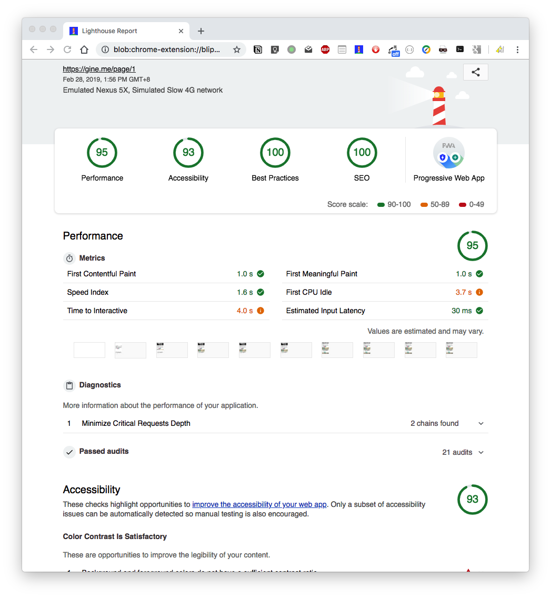
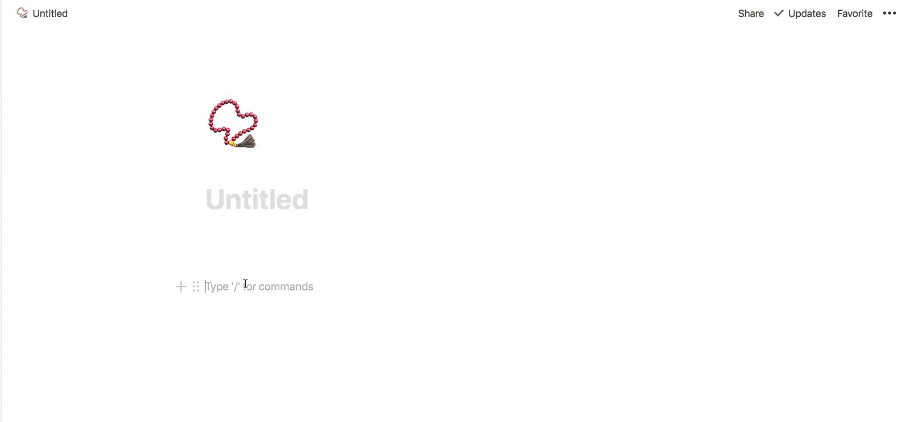

# gine-blog

gine-blog 是一个以notion为blog后端的,基于 React,Gatsby,Material-UI 的静态博客应用。


截图


性能报告



如果你想运行此程序，首先确保你已经有notion帐号。

架构图如下

假装这里有图.jpg

待画... 

## 安装

```
git clone https://github.com/mayneyao/gine-blog.git
```

## 前置条件

clone 下面这个page到自己的notion中,此页面包含了blog需要的2个表(文章表和友链)。后面你可以根据自己的喜好添加表格，做个性化的开发。

[https://www.notion.so/gine/share-blog-table-60e00520137944a4a45a437c7d089488](https://www.notion.so/gine/share-blog-table-60e00520137944a4a45a437c7d089488)

如何clone notion模板

也可以参考此文章：[https://notionpages.com/how-to-copy-a-notion-template/](https://notionpages.com/how-to-copy-a-notion-template/)


## 修改配置

根据 `config.js` 中的说明，修改为自己的配置。

默认配置是最小化的配置，只开启了blog相关的基本功能

- 文章列表页
- 文章详情页
- 全部标签页
- 标签详情页
- 归档
- 友链
- about 页面实际上是一篇post，你需要在配置中写入相关post的slug。

如果需要开启其它模块功能，按照配置文档操作即可。

## 运行

    # 安装依赖
    yarn 
    
    # 开发模式
    yarn develop
    
    # 编译
    yarn build
    
    # 本地访问 build之后
    yarn serve


## 配置说明

### comment 开启评论

评论模块采用的是disqus，开启后填上自己的短域名即可


### blog 开启github缓存文章加速build 

你需要新建一个仓库用来缓存blog文章内容。

访问 https://github.com/settings/tokens 获取token 

加入token到环境变量

```
export GitHubToken='yourtokenhere'
```

### bangumi 开启番剧模块

填个b站的链接就好了，会把你订阅的番剧数据爬下来，以卡片形式按番剧发行时间顺序展示。

待续...

## FAQ

### 为什么安装依赖这么慢？
初次安装依赖，会安装puppetter，所以比较慢