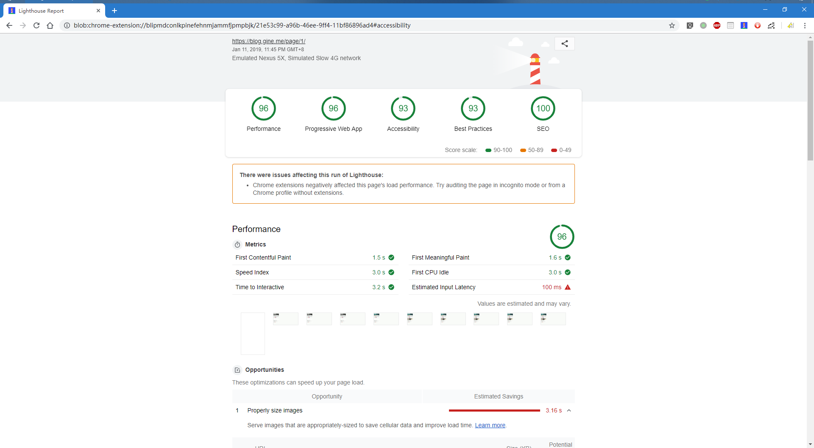

## 为什么又要造轮子

- blog 很久没写了（没东西写）
- 熟悉 `gatsby` `graphql`
- 静态页面优点
    - SEO友好
    - 速度快
- hexo的ejs就像老奶奶的裹脚布，希望用熟悉的技术栈来构建自己的blog
- `gatsby` 的模式深得我❤️
- `notion` 可以用来写作，但是不适合分享给别人看，也不适合交流
- `notion` ~~马上(可能是明年吧，鸽鸽鸽~)~~要开api了，云端协作，自动同步岂不美哉😆

## 要造成什么样的轮子

- Plan A

    理想的情况是以 `notion` 作为协作的后端。文章发布后（share public access ），webhook发 `netlify` 的build 动作, `gatsby` build 的时候拉取 `notion` 的文章数据编译成静态页面。

    

    鉴于目前notion开放api的日程一直在推后(疯狂摸鱼)，对基于官方API的自动化部署不抱太大的希望

- Plan B

    用非官方的notion-py，自己搭建一个推送数据服务。目前没有直接生成markdown的接口。返回的文章全是block。构建一套react组件一一映射notion的block。

- Plan C
    - 手动挡导出blog页面的所有文章为markdown格式
    - notion的markdown 格式不统一，丢失了code block 的 language信息，需要再处理一遍 markdown

A > B > C 目前是C方案，开三个分支慢慢搞。两开花两开花💐

- [x]  Plan C
    - 继续优化
- [ ]  Plan B
    - 开新的分支实验一下api
- [ ]  Plan A
    - 等notion开放api

## 先导任务

- [x]  看gatsby文档，熟悉使用

## Gatsby 使用体验

- `graphql` 真香
- 可以从任意数据源生成 graphql 数据
- 可以结合远程 api 做成静态+动态内容
- 如果 api 数据较少，可以直接 graphql 缓存下来

## Lighthouse Report

是不是很香2333

## Roadmap

- 代码地址： [https://github.com/mayneyao/gine-blog](https://github.com/mayneyao/gine-blog)
- demo地址：[https://blog.gine.me/page/1](https://blog.gine.me/page/1)

- TODO
    - [x]  列表页
        - [x]  分页组件
    - [x]  文章页
        - [x]  头图
        - [x]  tags
        - [ ]  评论
        - [x]  发布时间
        - [ ]  TOC
    - [x]  底部
        - [x]  格言
    - [x]  全部标页——标签云
        - 用了标签后，就不用分类了。2者功能重叠，tag扁平一点。
        - [ ]  better css
    - [x]  归档——timeline
        - [ ]  better css
    - [x]  标签详情页 关于该标签的所有文章全部列出来
    - [x]  404
    - [ ]  集成 google analytics
    - [ ]  友链
    - [ ]  about me
    - [x]  域名 https
    - [x]  PWA 离线体验
    - [x]  sitemap SEO优化
    - [ ]  RSS