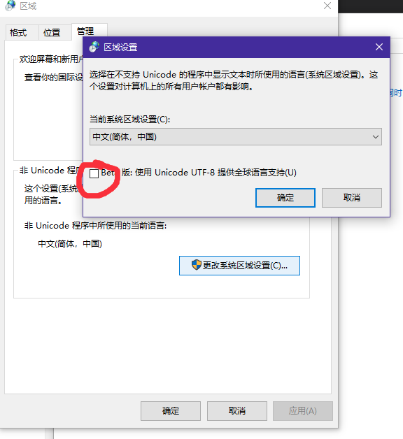

## 事实

- 写了一段py代码，在mac下表现良好，在win下编码错误。
- 代码涉及到文件操作
- python3
- code

        with open('xxx','w') as f:
        	....

搜索的过程就按下不表了，直接说结论

## 结论

- python中提到编码，一般分2种。
    1. py代码的编码，一般在代码头部指明这个py文件用什么编码。
    2. 文件的编码，即下面提到的打开文件指明文件的编码格式。
- linux mac 下的系统默认编码格式是 `utf-8`
- win下默认的系统编码格式是gbk
    - 前一段时间不知道哪里听到的消息：win将会采用utf-8作为系统编码格式，不知道现在最新的win10是不是已经是这样了，我的企业版win10，没有追求更新。所以还是gbk编码
- 画重点！python中文件读写的编码处理

        open(file, mode='r', buffering=-1, encoding=None, errors=None, newline=None, closefd=True, opener=None)

    > In text mode, if encoding is not specified the encoding used is platform dependent: locale.getpreferredencoding(False) is called to get the current locale encoding.

- 代码在mac上跑没问题，是因为mac的默认系统编码就是utf-8。文件格式和系统默认格式相同。所以在mac上用 python 进行文件读写操作，一般不需要显式的指明 `encoding`
- 但是在win上就不同，文件是utf-8 ，但系统默认编码是gbk，不指明encoding 就会报错。
- **解决的办法就是把win的默认系统编码设置成utf-8**
- 在新版的win10中，系统提供了beta版的编码切换功能

## 参见

- [https://docs.python.org/3/library/functions.html#open](https://docs.python.org/3/library/functions.html#open)